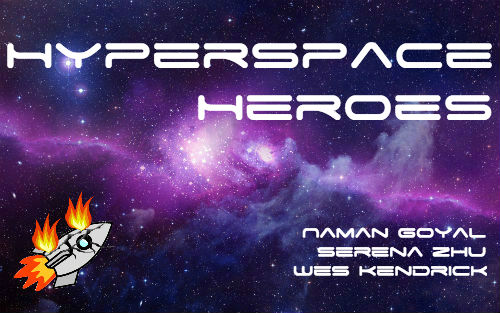
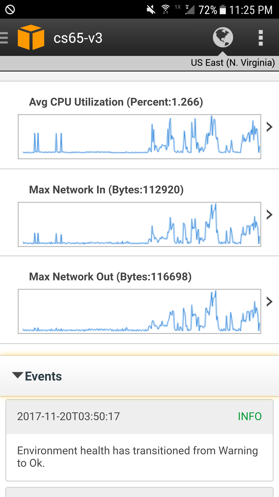

# aws-flask-cs65

## Final Project -- WEBSERVER



*CS65: Android Programming with Professor Bratus*  
*Serena Zhu, Wes Kendrick, and Naman Goyal*

DOCUMENTATION:
- /create_game
  - GET
  - https://hyperspaceheroes.com/create_game
  - example_parameters: ``
  - example response: ```
  {
  "game_id": 287
}```
- /create_acct
  - POST
  - https://hyperspaceheroes.com/create_acct
  - example parameters: `{"game_id": 287, "username": "wes"}`
  - example response: `{
    "STATUS": "SUCCESS",
    "player_id": 0
}`
- /number_of_players
  - GET
  - https://hyperspaceheroes.com/number_of_players
  - example_parameters: ``
  - example response: `{
    "number_of_players": 1
}`
- /start_game
  - GET
  - https://hyperspaceheroes.com/start_game
  - example_parameters: ``
  - example response: `{
  "username_list": [
    "wes",
    "naman",
    "serena"
  ]
}`
- /get_state
  - GET
  - https://hyperspaceheroes.com/get_state
  - example_parameters: ``
  - example response:
  ```
  {
      "assignments": [
          [
              0,
              0
          ]
      ],
      "counter": 9,
      "machine_health_arr": [
          3,
          3,
          2,
          3,
          3
      ],
      "session_status": "running"
  }
  ```
- /commander_set_assignment
  - POST
  -  https://hyperspaceheroes.com/commander_set_assignment
  - example_parameters: `{"player_id": 0, "machine_id": 3}`
  - example response: `{
    "STATUS": "SUCCESS"
}`
- /commander_generate_event
  - GET
  - https://hyperspaceheroes.com/commander_generate_event
  - example_parameters: ``
  - example response: `{
    "STATUS": "SUCCESS"
}`
- /player_set_task_result
  - POST
  - https://hyperspaceheroes.com/player_set_task_result
  - example_parameters: `{"machine_id": 3, "result": true}`
  - example response: `{
    "STATUS": "SUCCESS"
}`


**Recent Server Usage Statistics:**

